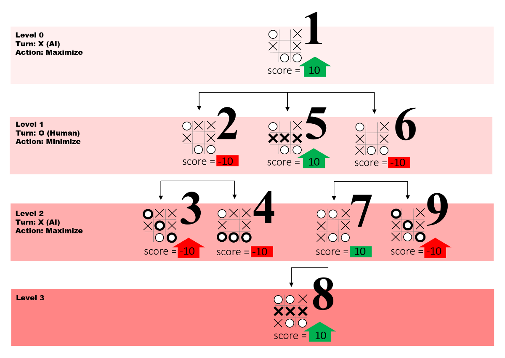

# tic_tac_toe

This is a small fun game which I used to play in my childhood. You can play this game with AI which is unbeatable. You can't beat this AI. I have used minimax algorithm for this game.

## Live Demo
[Demo](https://nfraz007.github.io/tic_tac_toe)

## Technology
* Vue JS
* Minimax Algorithm

## Project setup
Install All Dependencies
```
npm install
```

Compiles and hot-reloads for development
```
npm run serve
```

Compiles and minifies for production
```
npm run build
```

## Snapshot

* Game


## Minimax Algorithm
Minimax is a kind of backtracking algorithm that is used in decision making and game theory to find the optimal move for a player, assuming that your opponent also plays optimally. It is widely used in two player turn-based games such as Tic-Tac-Toe, Backgammon, Mancala, Chess, etc.

In Minimax the two players are called maximizer and minimizer. The maximizer tries to get the highest score possible while the minimizer tries to do the opposite and get the lowest score possible.

